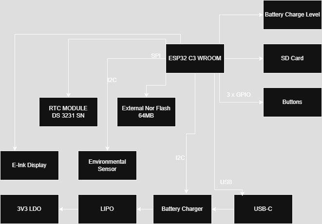

# OpenBook ESP32-C6 Complete Hardware Guide

## Overview
The OpenBook is an e-reader built around the ESP32-C6 chip. It uses an e-paper screen (like Kindle), has an SD card slot for books, can check room temperature and air quality, and has a battery that lasts a long time. It connects to Wi-Fi and Bluetooth so you can download books and update it.

## Main Parts

### Brain: ESP32-C6-WROOM-1-N8
- **What It Does**: Controls everything in the device
- **Architecture**: RISC-V (Single-Core)
- **Wireless**: Wi-Fi 6, Bluetooth 5 LE
- **Power Needs**: 3.3V
- **How It Talks**: SPI, I²C, UART, GPIO, USB

## Display Details

### E-Paper Screen
- **How It Connects**: SPI (shares wires with SD card)
- **Wires**:
  - Select Wire (EPD_CS): `GPIO 10`
  - Command Wire (EPD_DC): `GPIO 5`
  - Reset Wire: `GPIO 23`
  - Busy Signal: `GPIO 3`
  - Data Wires: shared with SD card
- **Screen Size**: 1404 × 1872 pixels (6.8")

## Memory Options

### SD Card Slot
- **How It Connects**: SPI
- **Wires**:
  - Select Wire (SS_SD): `GPIO 4`
  - Data Out (MOSI): `GPIO 7`
  - Data In (MISO): `GPIO 27`
  - Clock (SCK): `GPIO 6`
- **Space**: Works with cards up to 32GB

### Built-in Flash Memory (64MB)
- **How It Connects**: SPI (shared)
- **Wires**:
  - Select Wire (FLASH_CS): `GPIO 12`
  - Shared: `MOSI`, `MISO`, `SCK`
- **What It Stores**: System files, fonts, and some books
- **Chip Used**: W25Q512JVEIQ (Winbond)

## Power System

### Power Supply
- **Gets Power From**: USB-C (5V)
- **Gives Power At**: 3.3V using a voltage regulator
- **Battery**: 3.7V Li-Po, 2000mAh

### Charging System
- **What It Does**: Charges the Li-Po battery
- **Charging Speed**: 500mA
- **Chip Used**: MCP73831T-2ACI-OT (Microchip)

### Battery Monitor
- **What It Does**: Checks battery level and voltage
- **How It Connects**: I²C
- **Chip Used**: MAX17048G+T10 (Analog Devices)

### Backup Power
- **What It Does**: Keeps critical parts running during battery swaps
- **Part Used**: CPH3225A supercapacitor (Seiko)

## Sensors

### Air Quality Sensor – BME688
- **What It Measures**: Temperature, humidity, air pressure, gas levels
- **How It Connects**: I²C (shares wires with clock)
- **Power Needs**: 3.3V
- **Power Control Wire**: `GPIO 17`

### Clock Chip – DS3231SN
- **What It Does**: Keeps accurate time even when powered off
- **How It Connects**: I²C
- **Wires**:
  - Clock Wire (SCL): `GPIO 20`
  - Data Wire (SDA): `GPIO 19`
  - Alert Wire (INT): `GPIO 8`
  - Timing Wire (32KHz): `GPIO 9`
  - Reset Wire: `GPIO 16`
- **How Accurate**: About 1 minute off per year

## Connecting to Other Things

### USB-C Port
- **What It Does**: Charges the device and transfers data
- **Data Wires**:
  - USB_D-: `GPIO 13`
  - USB_D+: `GPIO 14`
- **Protection**: Has surge protection (USBLC6-2SC6Y chip)

### Expansion Port (Qwiic / Stemma QT)
- **What It Does**: Lets you add other sensors or devices
- **How It Connects**: I²C
- **Power Out**: 3.3V
- **Wires**: Uses the same I²C wires as other parts

## User Buttons
- **Boot Button**: Connected to `GPIO 15` (changes boot mode)
- **Reset Button**: Connected to pin 3 (restarts device)
- **Mode Button**: Connected to `GPIO 23` (changes display modes)

## Protection Features
- Surge protectors on USB and other wires
- Protection against putting batteries in backward
- Static electricity protection

## How Parts Connect

| Pin Number | What It Does | Connects To | More Info |
|------------|--------------|-------------|-----------|
| 3 | RESET | Reset Button | Restarts the whole system |
| 4 | SS_SD | SD Card (pin 2) | Selects the SD card for talking |
| 6 | SCK | SD Card (pin 5) | Clock beat for data timing |
| 7 | MOSI | SD Card (pin 3) | Sends data out to SD card |
| 8 | INT_RTC | Clock Chip (pin 3) | Gets alerts from the clock |
| 9 | 32KHz | Clock Chip (pin 1) | Gets timing signal from clock |
| 13 | USB_D- | USB-C Port (pin 3) | USB negative data wire |
| 14 | USB_D+ | USB-C Port (pin 1) | USB positive data wire |
| 15 | IO/BOOT | Boot Button | Selects startup mode |
| 16 | RTC_RST | Clock Chip (pin 4) | Resets the clock chip |
| 17 | I2C_PW | Air Sensor (pins 6, 8, 2) | Controls power to air sensor |
| 19 | SDA | Multiple devices | Shared data wire for I²C |
| 20 | SCL | Multiple devices | Shared clock wire for I²C |
| 23 | IO/CHANGE | Mode Button | Changes display/device mode |
| 27 | MISO | SD Card (pin 7) | Gets data from SD card |

## How It All Connects

## BOM

| Component | Link | Estimated Price |
|------------|------|----------------|
| R1_PINH1, R2-PINH1, R_BOOT, R_CHARGE, R_CL1, R_RESET | https://componentsearchengine.com/part-view/R0402%201%25%20100%20K%20(RC0402FR-07100KL)/YAGEO | €0.01 (per unit) |
| R1, R1-PINH, R2-PINH, R4, R5, R6, R7, R8, R9, R10 | https://componentsearchengine.com/part-view/R0402%201%25%20100%20K%20(RC0402FR-07100KL)/YAGEO | €0.01 (per unit) |
| C5 | https://componentsearchengine.com/part-view/CC0402MRX5R5BB106/YAGEO | €0.10 |
| EPD_C1, EPD_C2, EPD_C5, EPD_C6, EPD_C7, EPD_C8, EPD_C9, EPD_C10, EPD_C11, EPD_C12 | https://componentsearchengine.com/part-view/CC0402MRX5R5BB106/YAGEO | €0.10 (per unit) |
| R2 | https://componentsearchengine.com/part-view/R0402%201%25%20100%20K%20(RC0402FR-07100KL)/YAGEO | €0.01 |
| R1_BAT | https://componentsearchengine.com/part-view/R0402%201%25%20100%20K%20(RC0402FR-07100KL)/YAGEO | €0.01 |
| U4 | https://www.snapeda.com/api/url_track_click_mouser/?unipart_id=329239&manufacturer=Analog%20Devices&part_name=MAX17048G+T10&search_term=None | €3.80 |
| J2 | https://componentsearchengine.com/part-view/USB4110-GF-A/GCT%20(GLOBAL%20CONNECTOR%20TECHNOLOGY) | €0.95 |
| D1 | https://www.snapeda.com/parts/USBLC6-2SC6Y/STMicroelectronics/view-part/?ref=eda | €0.60 |
| U1 | https://www.snapeda.com/parts/W25Q512JVEIQ/Winbond+Electronics/view-part/?ref=eda | €4.20 |
| D3, D4, D5 | https://www.snapeda.com/api/url_track_click_mouser/?unipart_id=179458&manufacturer=ON%20Semiconductor&part_name=MBR0530&search_term=None | €0.40 (per unit) |
| D6, D8, D9, D10, D11, D12 | https://www.snapeda.com/api/url_track_click_mouser/?unipart_id=5659453&manufacturer=Littelfuse%20Inc.&part_name=PGB1010603MR&search_term=None | €0.30 (per unit) |
| J3 | https://www.digikey.ro/en/models/926710 | €1.05 |
| C1_BAT, C1_BAT1, C1_BAT2, C2_BAT, C5_USB | https://componentsearchengine.com/part-view/CC0402MRX5R5BB106/YAGEO | €0.10 (per unit) |
| C4 | https://componentsearchengine.com/part-view/CC0402MRX5R5BB106/YAGEO | €0.10 |
| R2-USB, R2-USB1 | https://componentsearchengine.com/part-view/R0402%201%25%20100%20K%20(RC0402FR-07100KL)/YAGEO | €0.01 (per unit) |
| C1, C2, C4_USB, C6, C7, C8, C9, C10, C_DELAY | https://componentsearchengine.com/part-view/CC0402MRX5R5BB106/YAGEO | €0.10 (per unit) |
| C3 | https://a360.co/4iZy6AA | €0.12 |
| J4 | https://store.comet.srl.ro/Catalogue/Product/43497/ | €0.35 |
| R_CAPACITOR | https://componentsearchengine.com/part-view/R0402%201%25%20100%20K%20(RC0402FR-07100KL)/YAGEO | €0.01 |
| R2_BAT | https://componentsearchengine.com/part-view/R0402%201%25%20100%20K%20(RC0402FR-07100KL)/YAGEO | €0.01 |
| TP1, TP2, TP3, TP4, TP5, TP6, TP7, TP8, TP9, TP10, TP11, TP12, TP13, TP14, TP15, TP16, TP17 | https://grabcad.com/library/test-points-printed-circuit-board-1 | €0.02 (per unit) |
| U2 | https://www.snapeda.com/parts/ESP32-C6-WROOM-1-N8/Espressif+Systems/view-part/?ref=eda | €4.50 |
| PFMF.050.1 | https://www.mouser.co.uk/ProductDetail/EPCOS-TDK/B72520T0350K062?qs=dEfas%2FXlABIszF52uu7vrg%3D%3D | €0.65 |
| CHG_LED | https://www.snapeda.com/parts/KP-1608SURCK/Kingbright/view-part/?ref=search&t=LED%200603 | €0.15 |
| SJ1 | https://grabcad.com/library/solder-jumpers-1 | €0.05 |
| SENSOR2 | https://www.snapeda.com/parts/BME680/Bosch/view-part/?welcome=home | €10.50 |
| MCP73831 | https://www.digikey.ro/en/products/detail/microchip-technology/MCP73831T-2ACI-OT/964301 | €0.75 |
| J1 | https://componentsearchengine.com/part-view/XC6220A331MR-G/Torex | €1.25 |
| R3 | https://componentsearchengine.com/part-view/R0402%201%25%20100%20K%20(RC0402FR-07100KL)/YAGEO | €0.01 |
| R1_PWRUSB | https://componentsearchengine.com/part-view/R0402%201%25%20100%20K%20(RC0402FR-07100KL)/YAGEO | €0.01 |
| IC4 | https://componentsearchengine.com/part-view/XC6220A331MR-G/Torex | €1.25 |
| L1 | https://eu.mouser.com/ProductDetail/Wurth-Elektronik/744043680?qs=PGXP4M47uW6VkZq%252BkzjrHA%3D%3D | €0.85 |
| IC1 | https://componentsearchengine.com/part-view/BD5229G-TR/ROHM%20Semiconductor | €1.20 |
| BOOT_BUTTON, CHANGE_BUTTON, RESET_BUTTON | https://www.snapeda.com/parts/EVQP7L01P/Panasonic/view-part/?ref=search&t=evqp7l | €0.25 (per unit) |
| C10_SUPERCAP | https://www.snapeda.com/api/url_track_click_mouser/?unipart_id=562593&manufacturer=Seiko%20Instruments&part_name=CPH3225A&search_term=None | €2.50 |
| U3 | https://www.snapeda.com/api/url_track_click_mouser/?unipart_id=99048&manufacturer=Analog%20Devices&part_name=DS3231SN#&search_term=None | €8.95 |
| Q2 | https://componentsearchengine.com/part-view/DMG2305UX-7/Diodes%20Incorporated | €0.55 |
| Q1, Q3 | https://componentsearchengine.com/part-view/SI1308EDL-T1-GE3/Vishay | €0.45 (per unit) |
| D2, D7 | https://eu.mouser.com/ProductDetail/KYOCERA-AVX/SD0805S020S1R0?qs=jCA%252BPfw4LHbpkAoSnwrdjw%3D%3D | €0.30 (per unit) |
